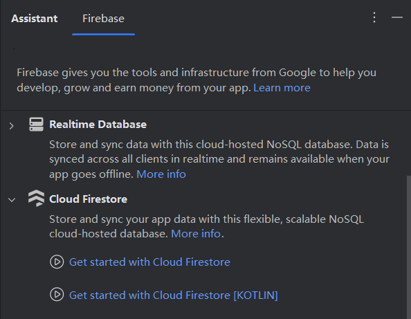

# 基于kotlin+jetpack compose+firebase+zegocloud实现的影视小说APP

## 📖 简介 (Introduction)
项目已经实现的功能：
- 1.点赞，收藏，追剧功能以及点赞收藏列表
- 2.发送弹幕
- 3.评论区
- 4.用户聊天

待实现功能:
- 1.AI总结视频内容，并生成摘要
- 2.智能监控观看视频时长，并实现AI“督促”效果
- 3.历史播放
---
## ✨ 特性 (Features)
- 🚀 **特性 1**: 使用了谷歌的firestore database，便于数据的管理
- 📦 **特性 2**: 
- 🔧 **特性 3**: 

---

## 🛠️ 安装 (Installation)

### 系统要求 (Requirements)

- kotlin>= 1.9
- android sdk>=35 

### 安装步骤 (Installation Steps)
**克隆仓库**

拉取本项目到本地，打开等待Android Studio自动下载依赖即可

## 🚀 使用指南 (Usage)
1.**注册firebase账号**
[注册](https://firebase.google.com)

2.**连接firebase**

在工具栏里面找到firebase，点击，在右侧弹出的栏里找到Cloud Firestore,选择get started，然后按照指示操作即可。

3.**创建数据库**

4.**注册zego账号**

[注册](https://www.zegocloud.com/)，并申请账号，在ChatActivity文件中填入自己的appID和appSign即可
#### 🔍 **说明**

你也可以不用firebase和zego，只用本地数据库，但需要自己实现相关功能。[不用zego实现聊天功能](https://www.youtube.com/watch?v=A41hkHoYu4M)，当然这也是其中一种实现方式。可以不选择。
